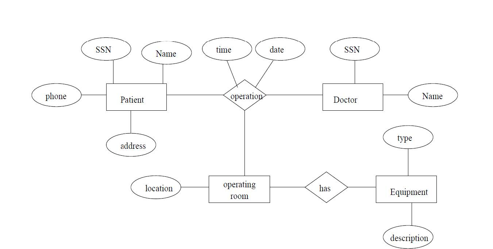

# CS336 Midterm 1 - Practice

1. Given the following partial ER diagram

   

   1. Draw a new ER diagram with no n-ary relationships (use reification).
   2. Underline primary keys and show cardinality constraints.
   3. Show weak entities and relationships.
   4. Give the relational schema (include integrity constraints).

2. In the following exercise no n-ary relationships are allowed

   Draw the E/R diagram for the following database description. You must use inheritance and include all the details, such as keys, weak entities (if any), etc.

   > There are two types of patients admitted to a hospital. Out-patients and Resident-patients. Both have a responsible Physician assigned and have an Admit-date. Only Resident-patients are assigned a bed (which may be currently empty). Both types of patients are identified by a patient ID. Out-patients have a Check-Back-Date when they are to return for further testing, and a Resident-patient has a Discharge-Date. Beds are assigned to hospital rooms, there are at most 2 beds in each room. There are two types of beds, ICU beds and regular beds. Beds do not have a serial number or ID. Physicians have also SSN, name, address and phone number.
